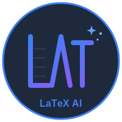

# LaTeX AI Editor

<div align="center">
  
  
  <h3>A Modern, Intelligent LaTeX Editor</h3>
  
  [](https://opensource.org/licenses/MIT)
  [](https://www.typescriptlang.org/)
  [](https://reactjs.org/)
  
  [Features](#features) • [Installation](#installation) • [Usage](#usage) • [AI Providers](#ai-providers) • [Contributing](CONTRIBUTING.md)
</div>

---

## 🚀 Overview

LaTeX AI Editor is a powerful, modern web-based LaTeX editor with integrated AI assistance. Write, compile, and perfect your LaTeX documents with real-time preview and intelligent AI suggestions from multiple providers.

## ✨ Features

### 📝 Editor Capabilities
- **Monaco Editor Integration**: Professional code editing with syntax highlighting, autocomplete, and IntelliSense
- **Multi-file Support**: Work with multiple `.tex` files, bibliography (`.bib`), and images
- **Real-time Compilation**: Instant PDF preview with error highlighting
- **Overleaf-style Interface**: Familiar three-panel layout with file manager
- **Tabbed Preview**: Switch between PDF preview and compilation logs
- **Syntax Highlighting**: Custom LaTeX language support with syntax coloring

### 🤖 AI Assistance
- **Multi-Provider Support**: Choose from Google Gemini, OpenAI, Anthropic Claude, or Ollama (local)
- **Smart Commands**:
  - 💡 **Write**: Generate LaTeX code from natural language descriptions
  - 🔍 **Debug**: Identify and explain compilation errors
  - 🔧 **Fix**: Automatically fix LaTeX errors with AI suggestions
  - ✏️ **Improve**: Get AI suggestions with side-by-side diff preview
- **Floating AI Assistant**: LinkedIn-style draggable chat widget
- **Diff Preview**: Review AI suggestions before applying changes
- **Abort Control**: Cancel long-running AI requests

### 🎨 User Interface
- **Resizable Panels**: Customize your workspace layout
- **Fullscreen Modes**: Focus on editing or preview
- **Dark Theme**: Eye-friendly interface optimized for long sessions
- **File Manager**: Organized folders for LaTeX files, bibliography, and images
- **Image Preview**: View images with LaTeX include code snippets
- **Responsive Design**: Works seamlessly on desktop and tablets

### 💾 Persistence & State
- **Auto-save**: All work automatically saved to localStorage
- **Session Persistence**: Editor preferences, panel layouts, and API keys persist across sessions
- **Compilation History**: View logs of past compilations (latest 50)
- **Multi-file Projects**: Full project state saved including all files and images

### ⚙️ Advanced Features
- **Compilation Modes**: Auto-compile on save or manual compilation
- **Editor Preferences**: Customizable font size, minimap, line numbers, word wrap
- **Layout Presets**: Quick switching between different workspace layouts
- **Keyboard Shortcuts**: Efficient workflow with keyboard navigation
- **Export**: Download compiled PDFs

## 📦 Installation

### Prerequisites
- **Node.js** v18 or higher
- **npm** or **yarn**

### Quick Start

1. **Clone the repository**
   ```bash
   git clone <repository-url>
   cd latex_editor
   ```

2. **Install dependencies**
   ```bash
   npm install
   cd server
   npm install
   cd ..
   ```

3. **Start development servers**
   
   **Option 1: Run both servers together (recommended)**
   ```bash
   npm run dev:all
   ```
   
   **Option 2: Run separately**
   ```bash
   # Terminal 1 - Backend server
   cd server
   npm start
   
   # Terminal 2 - Frontend
   npm run dev
   ```

4. **Open your browser**
   Navigate to `http://localhost:5173`

### Production Build

```bash
# Build frontend
npm run build

# Serve production build
npm run preview
```

The built files will be in the `dist` directory.

## 🎯 Usage

### Getting Started

1. **Open the editor** at `http://localhost:5173`
2. **Configure AI provider** (click Settings icon ⚙️)
3. **Start writing** LaTeX in the editor
4. **Compile** to see PDF preview (auto or manual mode)
5. **Use AI commands** for assistance

### AI Commands

#### 💡 Write
Ask AI to generate LaTeX code:
```
"Create a table with 3 columns showing student names, grades, and remarks"
"Write the quadratic formula with proper formatting"
```

#### 🔍 Debug
Get explanations for compilation errors:
- AI analyzes error logs
- Provides clear explanation of issues
- Suggests potential fixes

#### 🔧 Fix
Automatically fix compilation errors:
- AI reads error messages
- Generates corrected code
- Applies fixes to your document

#### ✏️ Improve
Get AI suggestions with preview:
- Request improvements or modifications
- View side-by-side diff of changes
- Accept or reject suggestions

### Multi-file Projects

1. **Add files**: Click "+" button in File Manager
2. **Supported types**: `.tex`, `.bib`, images (PNG, JPG, etc.)
3. **Include files**: Use standard LaTeX commands
   ```latex
   \input{chapters/introduction.tex}
   \bibliography{references.bib}
   \includegraphics{figures/diagram.png}
   ```

### Keyboard Shortcuts

- `Ctrl+S` / `Cmd+S`: Compile document
- `Ctrl+Enter` / `Cmd+Enter`: Send AI message
- `Shift+Enter`: New line in AI input
- `F11`: Toggle fullscreen

## 🤖 AI Providers

### Google Gemini
1. Get API key: [Google AI Studio](https://makersuite.google.com/app/apikey)
2. Free tier: 60 requests/minute
3. Model: `gemini-pro`

### OpenAI
1. Get API key: [OpenAI Platform](https://platform.openai.com/api-keys)
2. Pay-per-use pricing
3. Model: `gpt-3.5-turbo` or `gpt-4`

### Anthropic Claude
1. Get API key: [Anthropic Console](https://console.anthropic.com/)
2. Pay-per-use pricing
3. Model: `claude-3-sonnet` or `claude-3-opus`

### Ollama (Local)
1. Install: [Ollama.ai](https://ollama.ai)
2. Run server: `ollama serve`
3. Pull model: `ollama pull llama2`
4. Endpoint: `http://localhost:11434`
5. **Advantage**: Free, private, runs offline

## 🏗️ Architecture

### Tech Stack

**Frontend**
- React 18.3 with TypeScript 5.3
- Vite 5.0 (build tool)
- Monaco Editor (code editing)
- Zustand (state management)
- Tailwind CSS (styling)
- Lucide React (icons)

**Backend**
- Express.js (proxy server)
- LaTeX.Online API (compilation)
- tar-stream (multi-file bundling)

**AI Integration**
- Axios (HTTP client)
- Multiple provider APIs
- AbortController (request cancellation)

### Project Structure

```
latex_editor/
├── public/              # Static assets
│   └── logo.svg        # Application logo
├── server/             # Backend proxy server
│   ├── server.js       # Express server
│   └── package.json    # Server dependencies
├── src/
│   ├── components/     # React components
│   │   ├── AIAssistant.tsx      # AI chat widget
│   │   ├── Editor.tsx           # Monaco editor wrapper
│   │   ├── Preview.tsx          # PDF preview + logs
│   │   ├── FileManager.tsx      # File explorer
│   │   ├── Toolbar.tsx          # Top toolbar
│   │   └── Settings.tsx         # Settings modal
│   ├── services/       # API services
│   │   ├── aiService.ts         # AI provider integrations
│   │   └── latexCompiler.ts     # LaTeX compilation
│   ├── store/          # State management
│   │   └── editorStore.ts       # Zustand store
│   └── main.tsx        # App entry point
├── index.html          # HTML template
└── package.json        # Dependencies
```

## 🔒 Security & Privacy

- **API Keys**: Stored locally in browser (localStorage)
- **No Server Storage**: All data stays in your browser
- **Secure Transmission**: HTTPS for API requests
- **Local Option**: Use Ollama for complete privacy
- **No Tracking**: No analytics or telemetry

## 🤝 Contributing

We welcome contributions! Please see [CONTRIBUTING.md](CONTRIBUTING.md) for details on:
- Code of Conduct
- Development setup
- Pull request process
- Coding standards

## 📝 License

This project is licensed under the MIT License - see the [LICENSE](LICENSE) file for details.

## 🙏 Acknowledgments

- **LaTeX.Online** for compilation API
- **Monaco Editor** by Microsoft
- **AI Providers** for making intelligent assistance possible
- **Open Source Community** for amazing tools and libraries

## 📧 Contact & Support

- **Issues**: [GitHub Issues](<repository-url>/issues)
- **Discussions**: [GitHub Discussions](<repository-url>/discussions)
- **Author**: Nishant Verma

## 🗺️ Roadmap

- [ ] Real-time collaboration
- [ ] GitHub integration
- [ ] Template library
- [ ] Custom themes
- [ ] Plugin system
- [ ] Mobile app
- [ ] Self-hosted option
- [ ] LaTeX package manager

---

<div align="center">
  Made with ❤️ by the LaTeX AI Editor team
  
  ⭐ Star us on GitHub — it helps!
</div>

